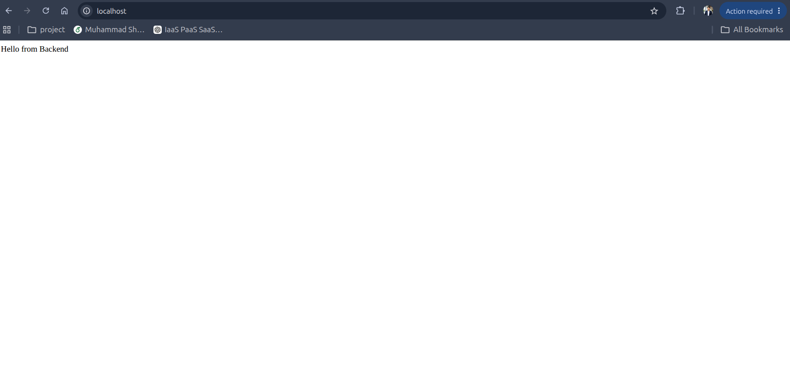

# screening_task



 

# DevOps Screening Task – Containerization Basics

## Overview

This project demonstrates a simple containerized application using Docker Compose. It consists of two services:

- **Nginx** – Acts as a reverse proxy.
- **Node.js Backend** – Returns the message `Hello from Backend`.

Nginx receives incoming HTTP requests and forwards them to the backend container over Docker's internal network.

---

## Architecture

Client (Browser)
        │
        ▼
Nginx (Port 80)
        │
        ▼
Node.js Backend (Port 3000)

---

## Network Configuration

Docker Compose automatically creates a bridge network for all services.

- The backend service is accessible using the hostname `backend`.
- Nginx forwards requests to `http://backend:3000`.
- Only Nginx is exposed to the host machine on port **80**.
- The backend remains private within the Docker network.

---

## Project Structure

```
devops-screening-task/
├── backend/
│   ├── Dockerfile
│   ├── package.json
│   └── server.js
├── nginx/
│   └── default.conf
├── docker-compose.yml
└── README.md
```

---

## How to Run

Build and start the containers:

```bash
docker compose up --build
```

Open your browser and visit:

```
http://localhost
```

Expected output:

```
Hello from Backend
```

---

## Technologies Used

- Docker
- Docker Compose
- Nginx
- Node.js
- Express.js

---

## Author

Muhammad
